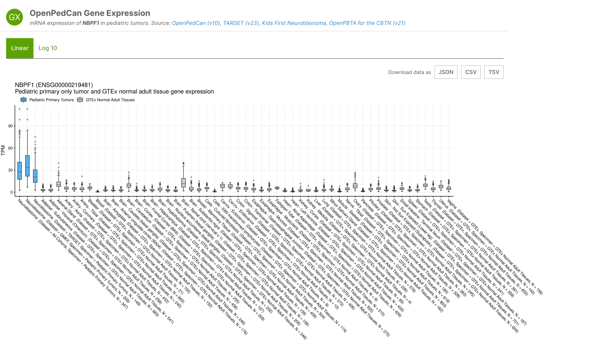

# MTP Documentation (DRAFT)

#### Contents
- [Datasets](#datasets)
- [Histology](#Histology)
- [Somatic Alterations](#Somatic_Alterations)
- [Gene Expression](#Gene_Expression)

## Datasets

**Open Pediatric Brain Tumor Atlas (OpenPBTA):** In September of 2018, the Children's Brain Tumor Network (CBTN) released the Pediatric Brain Tumor Atlas (PBTA), a genomic dataset (whole genome sequencing, whole exome sequencing, RNA sequencing, proteomic, and clinical data) for nearly 1,000 tumors, available from the Gabriella Miller Kids First Portal. The Open Pediatric Brain Tumor Atlas (OpenPBTA) Project is a global open science initiative to comprehensively define the molecular landscape of tumors of 943 patients from the CBTN and the PNOC003 DIPG clinical trial from the Pediatric Pacific Neuro-oncology Consortium through real-time, collaborative analyses and collaborative manuscript writing on GitHub.

**Therapeutically Applicable Research to Generate Effective Treatments (TARGET):** The Therapeutically Applicable Research to Generate Effective Treatments (TARGET) Initiative is an NCI-funded collection of disease-specific projects that seeks to identify the genomic changes of pediatric cancers. 'The overall goal is to collect genomic data to accelerate the development of more effective therapies. OpenPedCan analyses include the seven diseases present in the TARGET dataset: Acute Lymphoblastic Leukemia (ALL), Acute Myeloid Leukemia (AML), Clear cell sarcoma of the kidney, Neuroblastoma, Osteosarcoma, Rhabdoid tumor, and Wilm’s Tumor.

**Gabriella Miller Kids First Neuroblastoma (Kids First) The Gabriella Miller Kids First Pediatric Research Program (Kids First):** is a large-scale effort to accelerate research and gene discovery in pediatric cancers and structural birth defects. The program includes whole genome sequencing (WGS) from patients with pediatric cancers and structural birth defects and their families. OpenPedCan analyses include Neuroblastoma data from the Kids First project.

**The Genotype-Tissue Expression (GTEx):** GTEx project is an ongoing effort to build a comprehensive public data resource and tissue bank to study tissue-specific gene expression, regulation and their relationship with genetic variants. Samples were collected from 54 non-diseased tissue sites across nearly 1000 individuals, primarily for molecular assays including WGS, WES, and RNA-Seq. OpenPedCan project includes 17382 GTEx RNA-Seq samples from GTEx v8 release, which span across 31 GTEx groups in the v10 release.

---

## Histology

Pediatric cancers are rare and heterogeneous, and have a different biology even from adult cancers of the same name. Due to the complexity and rarity, there was no international standard of classification until the end of 2021 when WHO updated their standards to include a distinct section for pediatric tumors. Considering the challenges and historical lack of standards, disease assignment and molecular subtyping is a challenging process. For Open Targets, classifying pediatric tumors starts with the pathologist’s report from original diagnosis followed by confirmation of the molecular features of the disease using the repository data. The specific molecular features examined for each disease were determined by the literature with expert review and curation from both bioinformaticians and clinicians. A final disease label is assigned based on the combination of the clinical pathology report and the molecular features in the data. If there is a discrepancy between clinical and molecular labels, samples are reviewed by a pathologist and final disease assignment is made in consultation with pathology, bioinformatics, and clinicians. For each disease, a non-exhaustive list of synonyms as well as the specific Experimental Factor Ontology (EFO) label used can be found on the individual page for each disease. For more details on disease assignment see [OpenPedCan Molecular Subtyping and Pathology Documentation](https://github.com/PediatricOpenTargets/OpenPedCan-analysis/tree/dev/analyses/molecular-subtyping-pathology)

| Disease | Cohort | Number of Samples |
| --- | --- | --- |
|  |  |  |
|  |  |  |

---

## Somatic_Alterations

### Data Processing

#### DNA-seq Alignment and Haplotype Calling Workflow

For both whole genome, whole exome, and targeted panel DNA sequencing, the workflow begins by flagging duplicates and aligning fastq files, or re-aligning previously aligned BAMs, to the reference genome GRCh38 using bwa mem. The majority of Pediatric Molecular Target data is paired-end, but single end methods are provided if you want to apply the pipeline to your own data. Variants are called using GATK4 HaplotypeCaller. For more details on the alignment or to run the CAVATICA app yourself, see the GitHub release at [Kid's First Alignment and Haplotype Calling Workflow](https://github.com/kids-first/kf-alignment-workflow) and the [CAVATICA App](https://cavatica.sbgenomics.com/public/apps/cavatica/apps-publisher/kfdrc-alignment-workflow). Once in the Cavatica workflow page,  please click on the READ MORE link to open up the full documentation.

#### Somatic Variant Calling

Small variants are called using multiple tools: Strelka2 for single nucleotide variants (SNVs) and small insertions/deletions (INDELs), GATK Mutect2 for SNVs, multinucleotide variants greater than 1bp in length (MNVs) and INDELs, Lancet for SNVs, MNVs, and INDELs, and VarDict Java which calls SNVs, MNVs, INDELs and more. Larger copy number variants are also called using multiple tools as well: ControlFreeC, CNVkit and GATK CNV. CNVkit calls are adjusted for purity estimations using THeTa2. Manta is also used to determine structural variants (SVs) and INDELs. All calls are made using GRCh38 references and variants are then annotated using gnomAD and for cancer hot spots. Publicly available files are further subjected to “germline masking,” which removes low frequency variants that could be used to identify the sample donor. For more details see the GitHub release at [Kid's First Somatic Variant Workflow](https://github.com/kids-first/kf-somatic-workflow) or to run the pipeline see the [CAVATICA App](https://cavatica.sbgenomics.com/public/apps/cavatica/apps-publisher/kfdrc-somatic-variant-workflow) (for more documentation on CAVATICA, please click READ MORE).

### Somatic Alteration Data

#### Single Nucleotide Variants (SNVs)

Multiple callers were used to determine single nucleotide variants SNVs since the literature suggests this reduces false positives. Using custom R scripts, a consensus SNV file was constructed, consisting only of SNVs that were called by 2 or more variant callers: GATK Mutect2, Strelka2, Lancet, and VarDict Java.  See [the consensus calling documentation](https://github.com/kids-first/kf-somatic-workflow/blob/master/docs/kfdrc-consensus-calling.md) for more detail on how the calls were combined. Annotations, including alternative gene and protein IDs and cancer references, were also added, see [the annotation calling workflow](https://github.com/kids-first/kf-somatic-workflow/blob/master/docs/kfdrc_annotation_subworkflow.md) for more details.

A unique variant id consisting of the hg38 coordinates and the reference and alternative alleles was created for consistency. Then several variant frequencies were calculated for each of those IDs within each cancer group and cohort. The frequency in the overall dataset, for each unique variant and gene, is the percentage of patients that have that variant or gene in the given cohort out of all patients in that cohort. The frequency in primary or relapse tumors, for each unique variant and gene, is the percentage of samples that have that variant or gene in the given cohort out of all samples in that cohort. Note that the frequencies and counts may not tally as expected for several reasons. First, the total columns use unique patients, while the primary/relapse tumor columns use unique samples. Second, some submitters did not include information about the primary/relapse status of the samples, so those samples are omitted from the primary/relapse counts. Last, some patients or samples are included in multiple cohorts and may be counted multiple times. See [SNV frequencies documentation](https://github.com/PediatricOpenTargets/OpenPedCan-analysis/tree/dev/analyses/snv-frequencies) for details of how the unique variant ID, variant frequencies, and annotations were done using custom R scripts and see [see the hotspot detection documentation](https://github.com/AlexsLemonade/OpenPBTA-analysis/tree/master/analyses/hotspots-detection) for how SNV hotspots were called.

| Column name | Column description | Column values |
| --- | --- | --- |
| Gene symbol | HGNC symbol for the given gene |  |
| Variant ID hg38 | Specific name for the variant in human genome hg38 coordinates; for example chr12_94581668_T_C means that base 94581668 on chromosome 12 is not the reference thymine (T) but mutated to a cytosine (C) |  |
| Protein change | Amino acid change if mutation causes one; for example p.R317G means that the 317th amino acid is changed from arginine (R) to glycine (G) |  |
| PMTL | Whether the gene is a relevant target on the PMTL (Pediatric Molecular Target List) | Binary; either an R for relevant target or left blank if not |
| Dataset | See Pediatric Cancer Data Sources at https://ppdc-otp-dev.bento-tools.org/about | All Cohorts = all data sets combined, TARGET (Therapeutically Applicable Research to Generate Effective Treatments), GMFK (Gabriella Miller Kids First Neuroblastoma)  |
| Disease |  |  |
| dbSNP ID | If there is an id for the SNV in dbSNP, it’s given here, otherwise listed as novel |  |
| VEP impact | Predicted mutation impact from Ensebl Variant Effect Predictor | high = predicted to cause complete or nearly complete loss of function, moderate = predicted to reduce protein effectiveness, low = no change predicted, modifier = affects a non-coding region where predictions are difficult or there is no evidence of impact |
| SIFT impact | Predicted mutation impact from SIFT, with the score in parentheses. The closer the score is to 0, the more deleterious the mutation is predicted to be. | deleterious = SIFT score between 0 to 0.05 where mutation is predicted to decrease protein function, tolerated = SIFT score 0.05 to 1 where the mutation probably doesn’t affect protein function and the closer to 1 the more true that is |
| PolyPhen impact | Predicted mutation impact from PolyPhen, with the score in parentheses.  | probably damaging = mutation predicted to reduce or eliminate protein function, possibly damaging = mutation may effect protein function, benign = no effect on protein function |
| Variant classification | Type of variant |  |
| Variant type | Type of variant |  |
| Gene full name | Full name of gene from HGNC |  |
| Gene type |  |  |
| Protein RefSeq ID | Refseq ID for the protein (not the gene) |  |
| Gene Ensembl ID | Ensembl ID for gene |  |
| Protein Ensembl ID | Ensembl ID for protein |  |
| Total mutations / Subjects in dataset | Total number of samples with the SNV over the total number of disease samples in the given dataset |  |
| Frequency in overall dataset | Fraction of the samples for the given disease in the given dataset that have the SNV |  |
| Total primary tumors mutated / Primary tumors in dataset | Same as Total mutations, but for primary tumors only |  |
| Frequency in primary tumors | Same as Frequency in overall, but for primary tumors only |  |
| Total relapse tumors mutated / Relapse tumors in dataset | Same as Total mutations, but for relapse tumors only |  |
| Frequency in relapse tumors | Same as Frequency in overall, but for relapse tumors only |  |
| HotSpot | Yes or no is this a known recurrently occuring (hotspot) cancer mutation | binary: Y, N |
| OncoKB cancer gene | Yes or no whether the gene is a annotated cancer gene listed in OncoKB https://www.oncokb.org/ | binary: Y, N |
| OncoKB Oncogene | TSB | Whether the gene is an oncogene or tumor suppressor (TSG) | oncogene, TSG = tumor suppressor gene, blank if neither |
| PedcBio PedOT oncoprint plot | Link to oncoprint plot at Pediatric cBioPortal |  |
| PedcBio PedOT mutation plot | Link to mutation plot at Pediatric cBioPortal |  |

#### Copy Number Variants (CNVs)

Multiple callers were used to determine copy number variants (CNVs). A consensus CNV file was constructed, consisting of CNVs that were called by 2 or more copy number callers: ControlFreeC, CNVkit,  and GATK CNV. See [the consensus calling documentation](https://github.com/kids-first/kf-somatic-workflow/blob/master/docs/kfdrc-consensus-calling.md) for more detail on how the calls were combined. The various nomenclatures used by the different callers are harmonized to a standard description list of options: deep deletion for when both copies of the region are lost, loss for deletion of a single copy, neutral if copy number is the same as the genome copy number (cancer genomes may have a different ploidy), gain for one or two additional copies of the region over ploidy, and amplification for a gain of two or more copies over ploidy. Copy number variants were assigned to the genes they effected and annotations, including alternative gene and protein IDs and cancer references, were added.

Then several variant frequencies were calculated for each of those genes within each cancer group and cohort. The frequency in the overall dataset is the percentage of patients that have that a CNV affecting that gene in the given cohort out of all patients in that cohort. The frequency in primary or relapse tumors is the percentage of samples that that have that a CNV affecting that gene in the given cohort out of all samples in that cohort. Note that the frequencies and counts may not tally as expected for several reasons. First, the total columns use unique patients, while the primary/relapse tumor columns use unique samples. Second, some submitters did not include information about the primary/relapse status of the samples, so those samples are omitted from the primary/relapse counts. Last, some patients or samples are included in multiple cohorts and may be counted multiple times. See [the CNV frequencies documentation](https://github.com/PediatricOpenTargets/OpenPedCan-analysis/tree/dev/analyses/cnv-frequencies) for details of how the unique variant ID, variant frequencies, and annotations were done using custom R scripts.

| Column name | Column description | Column values |
| --- | --- | --- |
| Gene symbol | HGNC symbol for the given gene |  |
| Gene Ensembl ID | Ensembl ID for gene |  |
| Variant type | Categorical description of the variant type | deep deletion = lost both copies of region, loss = lost one copy of region, neutral = diploid or same ploidy as genome, gain = gained one addition copy of region, amplification = gained 2 or more copies of region |
| Variant category |  | Left blank if nothing |
| Dataset | See Pediatric Cancer Data Sources at https://ppdc-otp-dev.bento-tools.org/about | All Cohorts = all data sets combined, TARGET (Therapeutically Applicable Research to Generate Effective Treatments), GMFK (Gabriella Miller Kids First Neuroblastoma)  |
| Disease |  |  |
| Total alterations / Subjects in dataset | Total number of samples with the CNV over the total number of disease samples in the given dataset |  |
| Frequency in overall dataset | Fraction of the samples for the given disease in the given dataset that have the SNV |  |
| Total primary tumors altered / Primary tumors in dataset | Same as Total alterations, but for primary tumors only |  |
| Frequency in primary tumors | Same as Frequency in overall, but for primary tumors only |  |
| Total relapse tumors altered / Relapse tumors in dataset | Same as Total alterations, but for relapse tumors only |  |
| Frequency in relapse tumors | Same as Frequency in overall, but for relapse tumors only |  |
| Gene full name | Full name of gene from HGNC |  |
| PMTL | Whether the gene is a relevant target on the PMTL (Pediatric Molecular Target List) | Binary; either an R for relevant target or left blank if not |
| OncoKB cancer gene | Yes or no whether the gene is a annotated cancer gene listed in OncoKB https://www.oncokb.org/ | binary; Y, N |
| OncoKB Oncogene|TSG | Whether the gene is an oncogene or tumor suppressor (TSG) | oncogene, TSG = tumor suppressor gene, blank if neither |

---

## Gene_Expression

### Data Processing

The RNA-seq Alignment Workflow begins by trimming adapters, only if adapters are provided, using Cutadapt. Reads were then aligned using STAR in two-pass mode to reference genome GRCh38. While all MTP data is paired-end, methods are provided for single-end alignment if you are interested in processing your data in the same manner. Transcripts are quantified using RSEM  with the GENCODE v27 annotation, except for the GTEx samples which were not re-processed and are annotated using GENCODE v26. Fusion calling is done using both Arriba and STAR-Fusion and then filtered for high confidence fusion calls using annoFuse. QC metrics for the alignment are summarized using RNA-seQC. If you would like to view the code in more detail, please see the GitHub release [Kids First RNA-seq Workflow](https://github.com/kids-first/kf-rnaseq-workflow) and if you would like to run the pipeline, please see the [CAVATICA App](https://cavatica.sbgenomics.com/public/apps/cavatica/apps-publisher/kfdrc-rnaseq-workflow/6) (for more documentation on CAVATICA, please click READ MORE).

### Gene Expression Data

#### Fusions

Fusions are filtered using custom R scripts. Fusion calls are retained if they are called by both STAR-Fusion and Arriba and if the fusion was specific and present in 3 or more samples in a single disease. Fusions were then annotated with gene and fusion specific information as well as whether they are known cancer genes from OncoKB, TCGA, and COSMIC. Summary frequencies are calculated using R. See [the fusion filtering documentation](https://github.com/AlexsLemonade/OpenPBTA-analysis/tree/master/analyses/fusion_filtering) for specific code and further details. 

| Column name | Column description | Column values |
| --- | --- | --- |
| Fusion Name | Genes fused with the name of the genes fused separated by “--”. Gene order is the order they fused in with the dashes representing the breakpoint. |  |
| Fusion Type |  | frameshift, other |
| Gene Position | Whether the gene is to the left or right of the breakpoint. | Gene1A = gene to left of breakpoint, Gene1B = gene to right of breakpoint |
| Fusion Annotation |  |  |
| Breakpoint Location |  | genic |
| Annotations |  |  |
| Kinase Domain Retained Gene1A | Whether the kinase domain is retained; left blank if gene is not a kinase. | Yes/No |
| Kinase Domain Retained Gene1B | Whether the kinase domain is retained; left blank if gene is not a kinase. | Yes/No |
| Reciprocal exists either gene kinase | Whether or not the reciprocal fusion with the gene order around the breakpoint swapped exists | TRUE/FALSE |
| Gene1A/Gene1B/Gene2A/Gene2B Annotation | Left blank if no annotations | TumorSuppressorGene, Oncogene, TranscriptionFactor |
| Gene Ensembl ID | Official gene ID from Ensembl  |  |
| Dataset | See Pediatric Cancer Data Sources at https://ppdc-otp-dev.bento-tools.org/about | All Cohorts = all data sets combined, TARGET (Therapeutically Applicable Research to Generate Effective Treatments), GMFK (Gabriella Miller Kids First Neuroblastoma)  |
| Disease | See Histology sections. |  |
| Total alterations / Subjects in Dataset | Total number of samples with the given fusions over the total number of disease samples in the given Dataset |  |
| Frequency in overall dataset | Fraction of the samples for the given disease in the given dataset that have the fusion |  |
| Total primary tumors altered / Primary tumors in dataset | Same as Total alterations, but for primary tumors only |  |
| Frequency in primary tumors | Same as overall frequency, but for primary tumors only |  |
| Total relapse tumors altered / Relapse tumors in dataset | Same as Total alterations, but for relapse tumors only |  |
| Frequency in relapse tumors | Same as Total alterations, but for relapse tumors only |  |
| Gene full name | HGNC gene name |  |
| PMTL | Whether the gene is a relevant target on the PMTL (Pediatric Molecular Target List); left blank if not |  |
| OncoKB Cancer Gene | Yes or no whether the gene is a annotated cancer gene listed in OncoKB https://www.oncokb.org/ | Y/N |
| OncoKB Oncogene | TSB | Whether the gene is an oncogene or tumor suppressor (TSG) | oncogene, TSG = tumor suppressor gene, blank if neither |

### Transcript Expression

TPMs (transcripts per million reads) were calculated using RSEM and plotted using R. See CAVATICA public app for more details on RSEM.

### OpenPedCan Gene Expression Boxplot

OpenPedCan gene expression boxplot (**Figure 1**) summarizes the expression levels of a gene in multiple cancer and normal tissue types. The plotted gene expression levels are obtained from the bulk-tissue RNA-seq data in OpenPedCan-analysis release. In an OpenPedCan gene expression boxplot, each box summarizes the expression levels of a cancer or normal tissue type. The x-axis label of each box lists the corresponding cancer or normal tissue type, dataset, biospecimen type, and total number of samples. The y-axis value corresponds to gene expression level in the unit of transcript per million (TPM). The scale of y-axis can either be TPM or log10(TPM + 1), which can be selected by clicking the "Linear" (default) or "Log10" tab on the top left side of the boxplot.

**Figure 1.** OpenPedCan gene expression boxplot that summarizes the expression of NBPF1 gene in pediatric neuroblastoma and normal adult tissues.

The OpenPedCan gene expression boxplot widget on Molecular Targets Platform (MTP) “Evidence” and “Gene symbol” pages plots different sets of cancer and normal tissue types. On an MTP “Evidence” page, the widget plots all cancer types that have the same Experimental Factor Ontology (EFO) ID as the page and all normal tissue types. On an MTP “Gene symbol” page, the widget plots all cancer types.

The gene expression levels in each boxplot are also summarized in a table that can be downloaded in different formats for further analysis, by clicking the "JSON", "CSV", or "TSV" button on the top right side of the boxplot. In the summary table, each box in the boxplot is summarized in a row with the following columns:

| Column name | Column description |
| --- | --- |
| xLabel | X-axis label. |
| specimenDescriptorFill | Biospecimen descriptor of the box fill color. |
| boxSampleCount | Number of samples. |
| geneEnsemblId | Ensembl ID of the plotted gene. |
| geneSymbol | Symbol of the plotted gene. |
| pmtl | US Food & Drug Administration Pediatric Molecular Target Lists designation of the plotted gene. |
| dataset | Dataset that contains the samples. |
| disease | Cancer type. |
| gtexTissueSubgroup | Normal tissue type. |
| efo | Cancer Experimental Factor Ontology (EFO) ID. |
| mondo | Cancer Mondo Disease Ontology (Mondo) ID. |
| gtexTissueSubgroupUberon | Normal tissue type Uberon anatomical ontology ID. |
| tpmMean | Mean of TPM values. |
| tpmSd | Standard deviation of TPM values. |
| tpmMin | Minimum TPM value. |
| tpm25thPercentile | 25th percentile of TPM values. |
| tpmMedian | Median of TPM values. |
| tpm75thPercentile | 75th percentile of TPM values. |
| tpmMax | Maximum TPM value. |
