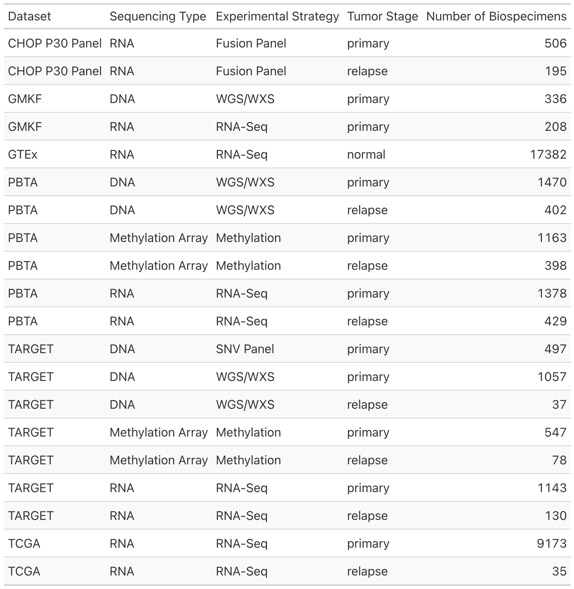

# Molecular Targets Platform Documentation 

The [Open Pediatric Cancer (OpenPedCan)](https://github.com/PediatricOpenTargets/OpenPedCan-analysis) project at the 
Children’s Hospital of Philadelphia, in partnership with the National Cancer Institute, is combining and harmonizing pediatric cancer datasets and integrating them into the [pediatric Molecular Targets Platform (MTP)](https://moleculartargets.ccdi.cancer.gov/) in order to accelerate pediatric cancer target identification and drug development. 
This is high-level overview of the MTP data processing and analysis. For more information on the MTP itself, see the [about page](https://moleculartargets.ccdi.cancer.gov/about). 

---

**Please note** that OpenPedCan is in continuous development and the GitHub repository main branch contents may not be identical to the Molecular Targets Platform site contents. While CHOP P30 DNA panel data is available through OpenPedCan, it is not available on the MTP site for this release.

---

For documentation on previous versions of the Molecular Targets Platform, please see [v1](past_versions/v1.md).

---

#### Contents

<!-- START doctoc generated TOC please keep comment here to allow auto update -->
<!-- DON'T EDIT THIS SECTION, INSTEAD RE-RUN doctoc TO UPDATE -->

- [Datasets](#datasets)
- [DNA Sequencing](#dna-sequencing)
  - [Data Processing](#data-processing)
    - [DNA-seq Alignment and Haplotype Calling Workflow](#dna-seq-alignment-and-haplotype-calling-workflow)
    - [Somatic Variant Calling](#somatic-variant-calling)
  - [Somatic Alteration Data](#somatic-alteration-data)
    - [Small Variants](#small-variants)
    - [Copy Number Variants (CNVs)](#copy-number-variants-cnvs)
- [RNA_Sequencing](#rna_sequencing)
  - [Data Processing](#data-processing-1)
  - [RNA Sequencing Data](#rna-sequencing-data)
    - [Fusions](#fusions)
    - [Gene Expression](#gene-expression)
    - [OpenPedCan Gene Expression Boxplot](#openpedcan-gene-expression-boxplot)
- [Data_Availability](#data_availability)
- [Citing the Molecular Targets Platform](#citing-the-molecular-targets-platform)

<!-- END doctoc generated TOC please keep comment here to allow auto update -->

## Datasets

While adult pan-cancer repositories have existed and accelerated cancer research for a decade, pediatrics cancers have been excluded, despite having different genetic and molecular etiologies than adult cancers. 
Over the past few years larger pediatric consortia, both disease-specific and pan-cancer, have tried to address this disparity. 
OpenPedCan is harmonizing the data from across these different consortia and presenting summarized data in one unified location in the pediatric MTP where it can be queried for associations between putative targets and pediatric cancers. 
As the project is ongoing, more data will continue to be added, but this current release includes four pediatric consortia datasets as well as GTEx data for comparisons to normal tissue expression:

For expanded descriptions of the datasets, please see the Pediatric Cancer Data Sources on the About page on the Molecular Targets Platform <https://moleculartargets.ccdi.cancer.gov/about>.

---

## DNA Sequencing

### Data Processing

#### DNA-seq Alignment and Variant Calling Workflow

For both whole genome, whole exome, and targeted panel DNA sequencing, the workflow begins by flagging duplicates and aligning fastq files, or re-aligning previously aligned BAMs, to the reference genome GRCh38 using bwa mem. 
The majority of Pediatric Molecular Target data is paired-end, but single end methods are provided if you want to apply the pipeline to your own data. 
Sequencing quality is checked using FastQC and NGSCheckMate is used to confirm tumor/normal DNA and normal DNA/ tumor RNA pairs come from the same individual. 
For more details on sample identity confirmation please see the [NGS Checkmate Workflow](https://github.com/d3b-center/OpenPBTA-workflows/blob/master/cwl/ngs_checkmate_wf.cwl). 
Somatic variants are called using Mutect2, Strelka2, Lancet, and VarDict, followed by a 2/4 consensus and hotspot scavenging.
For more detailed alignment and variant calling methods, please refer to the [OpenPBTA manuscript](https://www.biorxiv.org/content/10.1101/2022.09.13.507832v1). 
To run the CAVATICA apps yourself, see the [OpenPBTA workflows repository](https://github.com/d3b-center/OpenPBTA-workflows/tree/master/cwl) and the [CAVATICA App](https://cavatica.sbgenomics.com/public/apps/cavatica/apps-publisher/kfdrc-alignment-workflow). 
Once in the Cavatica workflow page, please click on the "Read All" link to open up the full documentation.

#### Somatic CNV Calling

Copy number variants are called using multiple tools: ControlFreeC, CNVkit, and GATK CNV. 
CNVkit calls are adjusted for sex using a pre-calculated germline sex estimate. 
Manta is used to call structural variants (SVs). 
All calls are made using GRCh38 references and variants are then annotated with gnomAD frequencies.
Publicly available files are further subjected to “germline masking,” which removes low frequency variants that could be used to identify the sample donor. 
For more details see the GitHub release at [Kid's First Somatic Variant Workflow](https://github.com/kids-first/kf-somatic-workflow) or to run the pipeline see the [CAVATICA App](https://cavatica.sbgenomics.com/public/apps/cavatica/apps-publisher/kfdrc-somatic-variant-workflow). 
Once in the Cavatica workflow page, please click on the "Read All" link to open up the full documentation. 
Panel data was not reprocessed and the variant files provided by the submitters were merged with our harmonized data files.

### Somatic Alteration Data

#### Small Variants

Multiple callers were used to determine single nucleotide variants (SNVs) since the literature suggests this reduces false positives. 
A consensus SNV file consisting only of SNVs that were called by 2 or more variant callers: GATK Mutect2, Strelka2, Lancet, and VarDict Java was created.
[Hotspot mutations](https://www.cancerhotspots.org/#/home) were annotated and recovered if called by only 1/4 algorithms above.
See [the consensus calling documentation](https://github.com/kids-first/kf-somatic-workflow/blob/master/docs/kfdrc-consensus-calling.md) for more detail on how the calls were combined. 
Annotations, including alternative gene and protein IDs and cancer references, were also added, see [the annotation calling workflow](https://github.com/kids-first/kf-somatic-workflow/blob/master/docs/kfdrc_annotation_subworkflow.md) for more details.

A unique variant id consisting of the hg38 coordinates and the reference and alternative alleles was created for consistency. 
Then several variant frequencies were calculated for each of those IDs within each cancer group and cohort. 
The frequency in the overall dataset, for each unique variant and gene, is the percentage of patients that have that variant or gene in the given cohort out of all patients in that cohort. 
The frequency in primary or relapse tumors, for each unique variant and gene, is the percentage of samples that have that variant or gene in the given cohort out of all samples in that cohort. 
Note that the frequencies and counts may not tally as expected for several reasons. 
First, the total columns use unique patients, while the primary/relapse tumor columns use unique samples. 
Second, some submitters did not include information about the primary/relapse status of the samples, so those samples are omitted from the primary/relapse counts. 
Third, panel sample data is not included in the all cohorts calculation.
Last, some patients or samples are included in multiple cohorts and may be counted multiple times. 
See [SNV frequencies documentation](https://github.com/PediatricOpenTargets/OpenPedCan-analysis/tree/dev/analyses/snv-frequencies) for details of how the unique variant ID, variant frequencies, and annotations were done using custom R scripts and see [see the hotspot detection documentation](https://github.com/AlexsLemonade/OpenPBTA-analysis/tree/master/analyses/hotspots-detection) for how SNV hotspots were called. 
Summarized tables are returned in response to queries on the Molecular Targets Platform (as described below). 
If you follow the links to Pediatric cBioPortal, sample-level data is available to view in the OncoPrint and Mutation tabs there as well as to download.

 

The following table gives the a description of the fields and corresponding values for SNV data both at the gene and variant level within MTP.

 

The following table gives the a description of the fields and corresponding values for SNV data both at the gene and variant level within MTP.

| Column Name | Description | Values |
| --- | --- | --- |
| Gene symbol | HGNC symbol for the given gene |  |
| Variant ID hg38 | Specific name for the variant in human genome hg38 coordinates; for example chr12_94581668_T_C means that base 94581668 on chromosome 12 is not the reference thymine (T) but mutated to a cytosine (C) |  |
| Protein change | Amino acid change if mutation causes one; for example p.R317G means that the 317th amino acid is changed from arginine (R) to glycine (G) |  |
| PMTL | Whether the gene is a relevant target on the PMTL (Pediatric Molecular Target List) | Binary; either an **R** for relevant target or **NR** for non-relevant target and left **blank** if no data |
| Dataset | See the Dataset section in this document for more details | **All Cohorts** = all datasets combined except for panel data, **TARGET** = Therapeutically Applicable Research to Generate Effective Treatments, **TARGET panel** = same as TARGET but the cohort sequencing panel data only, **PBTA** = Pediatric Brain Tumor Atlas, **GMKF** = Gabriella Miller Kids First Neuroblastoma |
| Disease | Cancer type | See [disease table](scripts/biospecimen_dataset_disease_counts.csv) |
| dbSNP ID | ID for variant in NCBI’s dbSNP database https://www.ncbi.nlm.nih.gov/snp/ if one exists | dbSNP ID starting with “**rs**” if it exists, **blank** if the variant is not in dbSNP but is in other variant databases, and **novel** if the variant is not in any database used |
| VEP impact | Predicted mutation impact from Ensembl Variant Effect Predictor; only mutations predicted to have some impact are reported | **high** = predicted to cause complete or nearly complete loss of function, **moderate** = predicted to reduce protein effectiveness, **modifier** = affects a non-coding region where predictions are difficult or there is no evidence of impact |
| SIFT impact | Predicted mutation impact from SIFT, with the score in parentheses. The closer the score is to 0, the more deleterious the mutation is predicted to be. If there is sufficient reference material available at that position, SIFT will warn that there’s low confidence in the predicted impact. SIFT only makes predictions for missense variants. | **deleterious**, **deleterious\_low\_confidence** = SIFT score between 0 to 0.05 where mutation is predicted to decrease protein function, **tolerated**, **tolerated\_low\_confidence** = SIFT score 0.05 to 1 where the mutation probably doesn’t affect protein function and the closer to 1 the more true that is, left **blank** if SIFT is not able to be applied to the variant |
| PolyPhen impact | Predicted mutation impact from PolyPhen, with the score in parentheses. The closer the score is to 1, the more deleterious the impact is predicted to be. If there isn’t sufficient data to make a prediction it’s reported as “unknown.” PolyPhen only makes predictions for missense variants. | **probably\_damaging** = mutation predicted to reduce or eliminate protein function with a score between 0.909 and 1, **possibly\_damaging** = mutation may effect protein function with a score between 0.446 and 0.908, **benign** = no effect on protein function with a score between 0.001 and 0.445, **unknown** = no prediction due to lack of data and assigned a score of 0, left **blank** if PolyPhen is not able to be applied to the variant |
| Variant classification | Variant effect on protein, whether frame is maintained, whether it’s a mutation or insertion/deletion and whether it effects specific translation regions | **Frame\_Shift\_Del** = deletion that changes reading frame, **Frame\_Shift\_Ins** = insertion that changes reading frame, **In\_Frame\_Del** = deletion but reading frame is unchanged, **In\_Frame\_Ins** = insertion but reading frame is unchanged, **Missense\_Mutation** = small variant that changes the amino acid coded for, **Nonsense\_Mutation** = small variant that adds a stop codon, **Nonstop\_Mutation** = mutation in the stop codon so that it no longer functions as a stop codon, **Splice\_Site** = mutation at an exon-intron boundary at a splice site, **Translation\_Start\_Site** = mutation at the translation start site |
| Variant type | The type of small variant; how many bases are affected or whether there was a small insertion or deletion | **DEL** = deletion, **DNP** = double nucleotide polymorphism, **INS** = insertion, **ONP** = oligo-nucleotide polymorphism, **SNP** = single nucleotide polymorphism, **TNP** = triple nucleotide polymorphism |
| Gene full name | Full name of the gene from HGNC |  |
| Gene type | A limited set of simplified annotations on what type of gene it is, especially whether it’s a known cancer gene | **CosmicCensus** = gene is in COSMIC, **Kinase** = gene is a kinase, **Oncogene** = gene is an known oncogene, **TranscriptionFactor** = gene is a transcription factor, **TumorSuppressorGene** = gene is a known tumor suppressor, left **blank** if no annotations apply |
| Protein RefSeq ID | Refseq ID for the protein (not the gene) |  |
| Gene Ensembl ID | Ensembl ID for gene |  |
| Protein Ensembl ID | Ensembl ID for protein |  |
| Total mutations / Subjects in dataset | Total number of samples with the SNV over the total number of disease samples in the given dataset |  |
| Frequency in overall dataset | Fraction of the samples for the given disease in the given dataset that have the SNV |  |
| Total primary tumors mutated / Primary tumors in dataset | Same as Total mutations, but for primary tumors only |  |
| Frequency in primary tumors | Same as Frequency in overall, but for primary tumors only |  |
| Total relapse tumors mutated / Relapse tumors in dataset | Same as Total mutations, but for relapse tumors only |  |
| Frequency in relapse tumors | Same as Frequency in overall, but for relapse tumors only |  |
| HotSpot | Yes or no is this a known recurrently occuring (hotspot) cancer mutation | binary: Y, N |
| OncoKB cancer gene | Whether the gene is a annotated cancer gene listed in OncoKB <https://www.oncokb.org/> | binary: Y, N |
| OncoKB Oncogene\|TSG | Whether the gene is annoated as an oncogene or tumor suppressor (TSG) in OncoKB <https://www.oncokb.org/> | **oncogene** = contributes to cancer development, **TSG** = tumor suppressor gene that suppresses cancer development, **oncogene,TSG** = if gene can be both, left **blank** if neither |
| PedcBio PedOT oncoprint plot | Link to oncoprint plot at Pediatric cBioPortal |  |
| PedcBio PedOT mutation plot | Link to mutation plot at Pediatric cBioPortal |  |

#### Copy Number Variants (CNVs)

Multiple callers were used to determine copy number variants (CNVs). 
A consensus CNV file was constructed, consisting of CNVs that were called by 2 or more copy number callers: ControlFreeC, CNVkit, and GATK CNV. 
See the [copy_number_consensus_call GitHub module] (https://github.com/PediatricOpenTargets/OpenPedCan-analysis/tree/29c344bc237eb5dd73f65cb7c1a04ae0c37414df/analyses/copy_number_consensus_call) for more detail on how the calls were combined. 
The various nomenclatures used by the different callers are harmonized to standard descriptions of CNVs: deep deletion for when copy number equals zero, loss for when copy number is less than ploidy, neutral if copy number is the same as the genome copy number (cancer genomes may have a ploidy other than two), gain for up to two times ploidy, and amplification for a gain of more than two times ploidy. 
Copy number variants were retained only if they overlapped by at least 1 base pair with a gene’s exon. 
Further annotations, including alternative gene and protein IDs and cancer references, were also added.

Then several variant frequencies were calculated for each of those genes within each cancer group and cohort. 
The frequency in the overall dataset is the percentage of patients that have that a CNV affecting that gene in the given cohort out of all patients in that cohort. 
The frequency in primary or relapse tumors is the percentage of samples that that have that a CNV affecting that gene in the given cohort out of all samples in that cohort. 
Note that the frequencies and counts may not tally as expected for several reasons. 
First, the total
 columns use unique patients, while the primary/relapse tumor columns use unique samples. Second, some submitters did not include information about the primary/relapse status of the samples, so those samples are omitted from the primary/relapse counts. 
Last, some patients or samples are included in multiple cohorts and may be counted multiple times. See [the CNV frequencies documentation](https://github.com/PediatricOpenTargets/OpenPedCan-analysis/tree/dev/analyses/cnv-frequencies) for details of how the unique variant ID, variant frequencies, and annotations were done using custom R scripts.

 

The following table gives the a description of the fields and corresponding values for CNV data within MTP.

 

The following table gives the a description of the fields and corresponding values for CNV data within MTP.

| Column Name | Description | Values |
| --- | --- | --- |
| Gene symbol | HGNC symbol for the given gene |  |
| Gene Ensembl ID | Ensembl ID for gene |  |
| Variant type | Categorical description of the variant type; cancer genomes may have a ploidy other than diploid which is why the categories are described in terms of the ploidy of the sample | **deep deletion** = 0 copies, **loss** = fewer copies than ploidy, **neutral** = same as ploidy, **gain** = up to 2 times ploidy, **amplification** = more than 2 times ploidy |
| Variant category |  |  |
| Dataset | See the Dataset section in this document for more details | **All Cohorts** = all datasets combined, **TARGET** = Therapeutically Applicable Research to Generate Effective Treatments, **PBTA** = Pediatric Brain Tumor Atlas, **GMFK** = Gabriella Miller Kids First Neuroblastoma  |
| Disease | Cancer type | See [disease table](scripts/biospecimen_dataset_disease_counts.tsv) |
| Total alterations / Subjects in dataset | Total number of samples with the CNV over the total number of disease samples in the given dataset |  |
| Frequency in overall dataset | Fraction of the samples for the given disease in the given dataset that have the CNV |  |
| Total primary tumors altered / Primary tumors in dataset | Same as Total alterations, but for primary tumors only |  |
| Frequency in primary tumors | Same as Frequency in overall, but for primary tumors only |  |
| Total relapse tumors altered / Relapse tumors in dataset | Same as Total alterations, but for relapse tumors only |  |
| Frequency in relapse tumors | Same as Frequency in overall, but for relapse tumors only |  |
| Gene full name | Full name of gene from HGNC |  |
| PMTL | Whether the gene is a relevant target on the PMTL (Pediatric Molecular Target List) | Binary; either an **R** for relevant target or **NR** for non-relevant target and left **blank** if no data |
| OncoKB cancer gene | Whether the gene is a annotated cancer gene listed in OncoKB <https://www.oncokb.org/> | binary; Y, N |
| OncoKB Oncogene\|TSG | Whether the gene is annoated as an oncogene or tumor suppressor (TSG) in OncoKB <https://www.oncokb.org/> | **oncogene** = contributes to cancer development, **TSG** = tumor suppressor gene that suppresses cancer development, **oncogene,TSG** = if gene can be both, **blank** if neither |

---

## RNA_Sequencing

### Data Processing

The RNA-seq Alignment Workflow begins by trimming adapters, only if adapters are provided, using Cutadapt. 
Sequencing quality is checked using FastQC and tumor/normal pairs are double-checked to confirm they are from the same individual using NGSCheckMate. 
For more details on sample identity confirmation please see the [Kid's First NGS Checkmate Workflow](https://github.com/kids-first/ngs_checkmate_wf). 
Reads were then aligned using STAR in two-pass mode to reference genome GRCh38. While all MTP data is paired-end, methods are provided for single-end alignment if you are interested in processing your data in the same manner. 
Transcripts are quantified using RSEM at both the gene and isoform level  with the GENCODE v27 annotation, except for the GTEx samples which were not re-processed and are annotated using GENCODE v26. 
Fusion calling is done using both Arriba and STAR-Fusion and then filtered for high confidence fusion calls using annoFuse. 
QC metrics for the alignment are summarized using RNA-seQC. 
If you would like to view the code in more detail, please see the GitHub release [Kids First RNA-seq Workflow](https://github.com/kids-first/kf-rnaseq-workflow) and if you would like to run the pipeline, please see the [CAVATICA App](https://cavatica.sbgenomics.com/public/apps/cavatica/apps-publisher/kfdrc-rnaseq-workflow/6). 
Once in the Cavatica workflow page, please click on the "Read All" link to open up the full documentation. 

### RNA Sequencing Data

#### Fusions

Gene fusions are called solely from RNA sequencing using the programs above. 
Fusions are filtered using custom R scripts. 
We use annoFuse to filter out artifactual fusions, those with both gene partners having expression < 1 TPM, or fusions present in normal tissues. 
We annotate genes as transcription factor, tumor suppressor, oncogene, and/or kinase and for kinase genes, identify whether or not the kinase domain is retained in the fusion.
Fusions present in more than 4 broad histologies are also flagged and filtered out, as they may be non-specific.
This final file of putative oncogenic fusions is the data utilized for the fusion frequency tables.
Fusion panels were not reprocessed and were merged with our harmonized fusion calls.
Summary frequencies are calculated using R. 
See [the fusion filtering documentation](https://github.com/AlexsLemonade/OpenPBTA-analysis/tree/master/analyses/fusion_filtering) for specific code and further details. 

 

The following table gives the a description of the fields and corresponding values for the gene fusion data both at the gene and variant level within MTP. 

| Annotation | Description | Values |
| --- | --- | --- |
| Fusion Name | Genes fused with the name of the genes fused separated by “--”. Gene order is the order they fused in 5’ to 3’ with the dashes representing the breakpoint. If the fusion is intergenic, the location will be represented by the two closest genes separated by a slash, /. For example "AACSP1--GABRP/RANBP17" means that AACSP1 fused with an intergenic DNA between GABRP and RNABP17. |  |
| Fusion Type | Whether the genes have fused in-frame or not. | **frameshift** = reading frame is shifted by 1 or 2 bp, **in-frame** = reading frame remains the same, **other** if neither applies |
| Gene Position | Whether the gene is to the 5’ or 3’ of the breakpoint | **Gene1A** = gene to left of breakpoint, **Gene1B** = gene to right of breakpoint, **Gene2A**, **Gene2B** = same side of breakpoint as others, but for the second gene given in an intergenic fusion |
| Fusion Annotation | Whether the fusion is found in other data sources | **TCGAfusion** = found in TCGA data, left **blank** if not |
| Breakpoint Location | Qualitative description of where the breakpoint is located related to the annotated gene | **genic** = breakpoint is in exon, **intragenic** = breakpoint is in gene but not the exon, **intergenic** = breakpoint is between genes |
| Annotations | Other information on the fusion from callers Arriba and STAR-Fusion that includes if the fusion was previously seen in cancer, more details about the fusion construction and more description about the type of fusion. | See the Arriba docs at <https://arriba.readthedocs.io/en/latest/output-files/> and the STAR-Fusion docs at <https://github.com/STAR-Fusion/STAR-Fusion/wiki#Outputs> for detailed descriptions of the annotations |
| Kinase Domain Retained Gene1A | Whether the kinase domain is retained in the 5’ gene | **Yes** = kinase domain retained, **Partial** = some but not all of the kinase domain is present, **No** = none of the kinase domain is present, left **blank** if no kinase domain in protein |
| Kinase Domain Retained Gene1B | Whether the kinase domain is retained in the 3’ gene |  **Yes** = kinase domain retained, **Partial** = some but not all of the kinase domain is present, **No** = none of the kinase domain is present, left **blank** if no kinase domain in protein |
| Reciprocal exists either gene kinase | Whether or not the reciprocal fusion with the gene order around the breakpoint swapped exists | Binary; TRUE, FALSE |
| Gene1A Annotation | A limited set of simplified annotations for the most 5’ gene in the fusion | **CosmicCensus** = fusion is in COSMIC, **Kinase** = one of the fusion genes is a kinase, **Oncogene** = one gene is an known oncogene, **TranscriptionFactor** = one of the fusion genes is a transcription factor, **TumorSuppressorGene** = one gene is a known tumor suppressor, left **blank** if no annotations apply |
| Gene1B Annotation | A limited set of simplified annotations for the most 3’ gene in the fusion | **CosmicCensus** = fusion is in COSMIC, **Kinase** = one of the fusion genes is a kinase, **Oncogene** = one gene is an known oncogene, **TranscriptionFactor** = one of the fusion genes is a transcription factor, **TumorSuppressorGene** = one gene is a known tumor suppressor, left **blank** if no annotations apply |
| Gene2A Annotation | A limited set of simplified annotations for the second gene on the 5’ side of an intergenic fusion | **CosmicCensus** = fusion is in COSMIC, **Kinase** = one of the fusion genes is a kinase, **Oncogene** = one gene is an known oncogene, **TranscriptionFactor** = one of the fusion genes is a transcription factor, **TumorSuppressorGene** = one gene is a known tumor suppressor, left **blank** if no annotations applyy |
| Gene2B Annotation | A limited set of simplified annotations for the second gene on the 3’ side of an intergenic fusion | **CosmicCensus** = fusion is in COSMIC, **Kinase** = one of the fusion genes is a kinase, **Oncogene** = one gene is an known oncogene, **TranscriptionFactor** = one of the fusion genes is a transcription factor, **TumorSuppressorGene** = one gene is a known tumor suppressor, left **blank** if no annotations apply |
| Gene Ensembl ID | Official gene ID from Ensembl  | |
| Dataset | See the Dataset section in this document for more details | **All Cohorts** = all datasets combined except for panel data, **TARGET** = Therapeutically Applicable Research to Generate Effective Treatments, **PBTA** = Pediatric Brain Tumor Atlas, **GMKF** = Gabriella Miller Kids First Neuroblastoma, **CHOP P30 panel** |
| Disease | Cancer type | See [disease table](https://github.com/PediatricOpenTargets/documentation/blob/dev/disease_subject_counts.tsv) |
| Total alterations / Subjects in Dataset | Total number of samples with the given fusions over the total number of disease samples in the given Dataset |  |
| Frequency in overall dataset | Fraction of the samples for the given disease in the given dataset that have the fusion |  |
| Total primary tumors altered / Primary tumors in dataset | Same as Total alterations, but for primary tumors only |  |
| Frequency in primary tumors | Same as overall frequency, but for primary tumors only |  |
| Total relapse tumors altered / Relapse tumors in dataset | Same as Total alterations, but for relapse tumors only |  |
| Frequency in relapse tumors | Same as Total alterations, but for relapse tumors only |  |
| Gene full name | Full name of the gene from HGNC |  |
| PMTL | Whether the gene is a relevant target on the PMTL (Pediatric Molecular Target List) | Binary; either an **R** for relevant target or **NR** for non-relevant target and left blank if no data |
| OncoKB Cancer Gene | Whether the gene is a annotated cancer gene listed in OncoKB <https://www.oncokb.org/> | binary; Y, N |
| OncoKB Oncogene\|TSB | Whether the gene is annoated as an oncogene or tumor suppressor (TSG) in OncoKB <https://www.oncokb.org/> | **oncogene** = contributes to cancer development, **TSG** = tumor suppressor gene that suppresses cancer development, **oncogene,TSG** = if gene can be both, **blank** if neither |

#### Gene Expression

TPMs (transcripts per million reads) were calculated using RSEM and plotted using R. 
Please see the [CAVATICA App](https://cavatica.sbgenomics.com/public/apps/cavatica/apps-publisher/kfdrc-rnaseq-workflow/6) for more details. 
Once in the Cavatica workflow page, please click on the "Read All" link to open up the full documentation. 

#### OpenPedCan Gene Expression Boxplot

OpenPedCan gene expression boxplot (**Figure 1**) summarizes the expression levels of a gene in multiple cancer and normal tissue types. 
The plotted gene expression levels are obtained from the bulk-tissue RNA-seq data in OpenPedCan-analysis release. 
In an OpenPedCan gene expression boxplot, each box summarizes the expression levels of a cancer or normal tissue type. 
The x-axis label of each box lists the corresponding cancer or normal tissue type, dataset, biospecimen type, and total number of samples. 
The y-axis value corresponds to gene expression level in the unit of transcript per million (TPM). 
The scale of y-axis can either be TPM or log10(TPM + 1), which can be selected by clicking the "Linear" (default) or "Log10" tab on the top left side of the boxplot.

**Figure 1.** OpenPedCan gene expression boxplot that summarizes the expression of NBPF1 gene in pediatric neuroblastoma and normal adult tissues.

The OpenPedCan gene expression boxplot widget on Molecular Targets Platform (MTP) “Evidence” and “Gene symbol” pages plots different sets of cancer and normal tissue types. On an MTP “Evidence” page, the widget plots all cancer types that have the same Experimental Factor Ontology (EFO) ID as the page and all normal tissue types. On an MTP “Gene symbol” page, the widget plots all cancer types.

The gene expression levels in each boxplot are also summarized in a table that can be downloaded in different formats for further analysis, by clicking the "JSON", "CSV", or "TSV" button on the top right side of the boxplot. 
In the summary table, each box in the boxplot is summarized in a row with the following columns:

| Column name | Column description |
| --- | --- |
| xLabel | X-axis label. |
| specimenDescriptorFill | Biospecimen descriptor of the box fill color. |
| boxSampleCount | Number of samples. |
| geneEnsemblId | Ensembl ID of the plotted gene. |
| geneSymbol | Symbol of the plotted gene. |
| pmtl | US Food & Drug Administration Pediatric Molecular Target Lists designation of the plotted gene. |
| dataset | Dataset that contains the samples. |
| disease | Cancer type. |
| gtexTissueSubgroup | Normal tissue type. |
| efo | Cancer Experimental Factor Ontology (EFO) ID. |
| mondo | Cancer Mondo Disease Ontology (Mondo) ID. |
| gtexTissueSubgroupUberon | Normal tissue type Uberon anatomical ontology ID. |
| tpmMean | Mean of TPM values. |
| tpmSd | Standard deviation of TPM values. |
| tpmMin | Minimum TPM value. |
| tpm25thPercentile | 25th percentile of TPM values. |
| tpmMedian | Median of TPM values. |
| tpm75thPercentile | 75th percentile of TPM values. |
| tpmMax | Maximum TPM value. |

---

## Data_Availability

If you would like to obtain larger datasets than those available for download through the MTP site, please see the instructions to download harmonized data through the [OpenPedCan-analysis repository](https://github.com/PediatricOpenTargets/OpenPedCan-analysis#how-to-obtain-openpedcan-data) or download directly from [CAVATICA](https://cavatica.sbgenomics.com/u/cavatica/opentarget).

---

## Citing the Molecular Targets Platform

If you used the Pediatric Molecular Targets Platform or the OpenPedCan-analysis repository data or code, please cite us!

- The Molecular Targets Platform (2022). NCI. https://moleculartargets.ccdi.cancer.gov
- PediatricOpenTargets (2022). OpenPedCan-analysis (Version 1.1). https://doi.org/10.5281/zenodo.7383318

  
